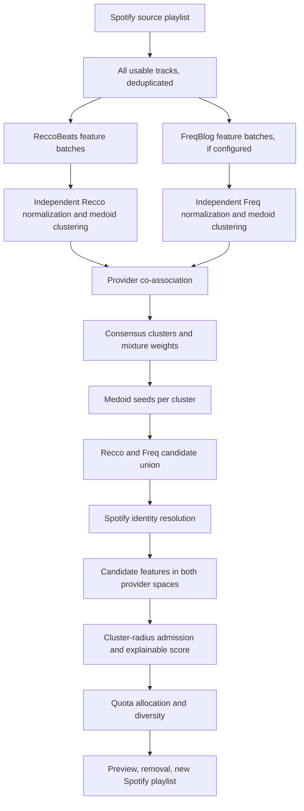

# Recommendation engine · `consensus-v1`

This document describes the implemented engine, its verified provider capabilities, engineering defaults, and limits. It does not claim that the numerical weights are scientifically optimal or that structural metrics equal human judgments of music quality.



## Verified provider capability map

The implementation was checked against the current official [ReccoBeats audio-feature specification](https://reccobeats.com/docs/apis/get-audio-features), [ReccoBeats recommendation specification](https://reccobeats.com/docs/apis/get-recommendation), and [FreqBlog OpenAPI 1.5.0](https://api.freqblog.com/openapi.json) on 24 September 2026. Every external response is parsed defensively; an absent or malformed numeric field remains `null`.

| Dimension | ReccoBeats `GET /v1/audio-features?ids=` | FreqBlog `POST /bulk` result | Engine treatment |
| --- | --- | --- | --- |
| Track lookup | 1–40 Recco UUID, Spotify ID, or ISRC identifiers; `content[]` returns UUID, Spotify `href`, ISRC | Up to 50 `{isrc, track, artist}` items; `results[]` aligns to input, `found=false` or `backfill_status` possible | Recco: Spotify ID; Freq: ISRC first, title/artist fallback; request-scoped cache |
| Tempo | `tempo`: BPM, documented typical 0–250 | `bpm`: BPM 20–300; nullable `bpm_alt`; `bpm_confidence` is a beat-strength value, not a probability | Raw values preserved; half/double-aware logarithmic distance; alternative only if actually present |
| Energy, danceability, valence | Numeric 0–1 | Nullable numeric 0–1; provider's own analysis/calibration | Provider-specific robust standardization; raw values never averaged across providers |
| Loudness | `loudness`: dB, typical −60–0 | `loudness_db`: nullable dBFS | Separate standardized views |
| Acousticness, instrumentalness, speechiness, liveness | Numeric 0–1 | Nullable numeric 0–1 | Missing excluded from pairwise distance, not converted to zero |
| Key and mode | `key`: pitch-class integer 0–11, `-1` undetected; `mode`: 0 minor, 1 major | Nullable `key_int`, `mode`, `camelot`, `open_key`; nullable `key_confidence` 0–1 | Circular pitch distance; Camelot wheel where available; low weight |
| Time signature | Not documented in Recco audio-feature response | Nullable integer `time_signature` | Low-weight categorical equality in Freq view only |
| Genre | Not documented | Nullable broad `genre` sourced from catalogue/open metadata | Small documented family map; original string retained |
| Mood | Not documented | Nullable `mood`; nullable five-axis `mood_vector` | Vector distance where both sides have it, otherwise label equality |
| Language | Not documented | Not documented | Always `null`; `LanguageMetadataProvider` interface is an unused extension point |
| Other Freq fields | Not applicable | Nullable `onset_rate`, `dynamic_complexity`, `feature_source`, remix metadata and more | Provenance retained; low-level fields excluded from v1 score until calibrated |
| Confidence | No per-field confidence documented | Nullable `key_confidence`, `bpm_confidence`; no universal confidence for every field | Stored with provenance; no fabricated provider confidence |

FreqBlog response fields may be sparse for fallback catalogue layers. Its `feature_source` distinguishes analysis provenance. `bpm_confidence` is not treated as 0–1. ReccoBeats key and mode are documented and therefore used. No undocumented Recco genre, mood, Camelot, or time signature values are inferred.

Recommendation endpoints used: ReccoBeats `GET /v1/track/recommendation` with 1–5 Spotify track IDs and `size`; FreqBlog `GET /recommendations` with 1–5 numeric catalogue IDs in `seed_tracks` when `/bulk` resolved them, otherwise one medoid title/artist, plus `limit`, `exclude_seed_artists`, and `cross_genre=auto`. FreqBlog `/similar` and the embedding endpoint are not used. Its documented cosine `score` is retained as provider evidence but is not presented as a user similarity percentage.

## Data flow and canonical record

Every usable source track is attempted in each configured provider's feature lookup. The internal `TrackFeatureRecord` holds the Spotify identity, separate `reccobeats.raw` and `freqblog.raw` values, separate normalized values and coverage, plus a `canonical` object for display. Canonical fields prefer a present FreqBlog field, then a present ReccoBeats field; this object is **never** used to merge the two feature spaces for clustering. Language stays null. No Spotify audio is fetched or uploaded.

For 1,000 source tracks the upper bound is 25 Recco feature batches and 40 Freq bulk batches of 25. A batch may return partial data; pending/missing tracks remain missing for this interactive request. Source feature data is reused for medoids and Freq catalogue seed IDs. Candidate lookup is deduplicated and uses the same provider instances and request cache.

## Normalization, distance and clustering

For each provider and continuous feature separately, the engine fits a source-playlist median and IQR. With at least eight observations and nonzero IQR, the scale is `IQR / 1.349`; small or flat samples fall back to a bounded half-range. Candidate values use the **source** scale. Values are clipped to ±4 robust z units for stable distances. Raw values remain available for diagnostics and UI descriptions.

Distance is a weighted mean over dimensions present on **both** tracks. The weights live in [`recommendation-config.ts`](../lib/recommendations/recommendation-config.ts), including provider-specific reliability factors. Missing features are omitted from both numerator and effective denominator. If no dimensions overlap, distance is unknown. Tempo tests a plausible half, same, and double beat grid via a logarithmic BPM ratio. Pitch classes use circular distance; Camelot understands same key, relative major/minor, and adjacent wheel positions. Genre and mood remain categorical or vector-based signals. Genre mismatch is not a hard reject.

Each provider's analyzable source tracks are clustered **independently** with deterministic k-medoids over that provider's own distance matrix. Medoids work with mixed numeric, circular, categorical, and missing-aware distance, unlike ordinary Euclidean k-means. For at least eight tracks, k is selected from 2 through `min(8, floor(n/4))` by silhouette score with a small complexity penalty. If no split is sufficiently supported, k=1. For 1–3 tracks the engine uses seed mode; 4–7 use one profile. Both modes retain source exclusions.

For tracks available in both providers, the engine builds a co-association matrix: a pair receives the weighted sum of the two providers' same-cluster decisions. A second deterministic medoid clustering over `1 - association` creates consensus clusters; it does **not** compare provider cluster numbers directly. Source tracks with only one provider are attached to their nearest consensus cluster at lower confidence. No-feature tracks remain source exclusions and do not shape clusters. When the dual-provider overlap is too small, the larger available provider view supplies a labelled single-provider fallback; it is not called two-provider consensus.

Each cluster stores source members, mixture weight, up to five medoid indices, provider-specific 75th-percentile radius, coverage, agreement, tempo distribution, medians of documented features, genre/mood distributions, and a description derived from these data. For tiny groups, a documented radius floor prevents one identical source song from making all recommendations impossible. The lab reports provider silhouette, adjusted Rand index, co-association confidence, and coverage.

## Candidate generation, admission and ranking

The engine allocates a target count across source clusters by the largest-remainder method. Each cluster generates its own candidates from rotating medoid subsets: one Recco request and, when configured, one Freq recommendation request. The number of calls is bounded by the cluster limit of eight. A provider failure is local to that provider/cluster; successful batches survive. Candidate lists are a **union**, deduplicated by Spotify ID, ISRC, then normalized artist/title while preserving versions such as remix and live.

Candidates are resolved to real Spotify tracks with bounded concurrency and Spotify Search's current 10-result limit. Each unique resolved track is feature-enriched in both configured provider spaces. For each consensus cluster, candidate-to-medoid distances are computed independently, then divided by that cluster's provider-specific source radius. A candidate is accepted according to actual radius thresholds in one of three modes:

| Mode | Both view radius ceiling | One view ceiling | Max single-view share when both views exist |
| --- | ---: | ---: | ---: |
| Strict | 1.05 | 0.70 | 10% |
| Balanced | 1.50 | 1.15 | 30% |
| Exploratory | 2.10 | 1.55 | 45% |

When only one provider is available, the single-view share cap is relaxed; the radius ceiling still applies. No candidate is accepted with zero comparable views. The strongest acceptable cluster assignment wins. `Regenerate` changes the deterministic medoid subset and bounded candidate request size; it makes new provider requests and can surface next qualifying candidates rather than shuffling old results.

The explainable score is:

```text
0.58 × cluster fit
+ 0.20 × agreement of provider-relative cluster distances
+ 0.09 × generation evidence (seed cluster, rank, independent providers)
+ 0.05 × broad genre fit
+ 0.04 × mood fit
+ 0.04 × harmonic fit
```

These are tunable defaults, not calibrated similarity probabilities. Every candidate has component scores, provenance, distances, acceptance status and rejection reason in development diagnostics. The product displays a short rule-derived explanation and ordinal labels, never a fabricated percentage.

The final selection first fills each cluster's target quota with accepted candidates, then fills shortfalls from other accepted clusters. A mixed 30-track source normally caps the same main artist around two results. The cap grows for deliberately artist-focused sources; a per-artist-and-album cap also applies. If the qualified pool is thin, the cap can relax, but rejected tracks are not inserted simply to meet a quota. Thus the returned count can be below the requested maximum.

## Cache, quota, privacy and limits

The `RequestFeatureCache` key is `(provider, schema version, stable track identifier)` and lives only for one generation request. It does not contain a Spotify user ID or playlist ID, and there is no persistent database. Recco lookups use at most 40 IDs per call; Freq bulk requests use 25 items, below the documented 50-item maximum to reduce partial time-box responses. Feature batch concurrency is at most two; Freq candidate and Recco candidate calls are bounded by eight clusters. Provider 429 honors `Retry-After` with at most one short automatic retry; subsequent batches stop on quota errors. Freq `202`, queued, and processing entries are treated as pending without indefinite polling.

`EXTERNAL_RECOMMENDER_ENABLED=false` stops the pipeline before any provider transfer. Turning it on requires the deployment operator's own Spotify policy and provider data-processing review. FreqBlog is optional: without a key, the engine runs a transparently labelled Recco-only view. The engine does not train a model, scrape Spotify audio, store listening profiles, or claim to recreate Spotify's historical algorithm.

The interactive safety limit is 1,000 usable source tracks and 240 unique candidates per request. Catalogue coverage, FreqBlog free-tier quota, source cluster tightness, and Spotify Search ambiguity can all reduce result count. The metrics are engineering diagnostics rather than subjective quality scores.

## Development diagnostics and tuning

With a connected Spotify session in `next dev`, visit `/dev/recommender-lab` and provide a playlist ID. This route and its API return 404 in production. The lab shows source raw values and missingness, provider and consensus assignments, medoids, feature coverage, candidate provenance, distances, score components, rejections, and result mixture. It makes real provider calls only when the external recommender feature flag is on. Never use a real network call in automated unit tests.

Useful parameters to tune after real playlist listening tests are the feature weights, provider reliability, cluster-count penalty, radius floors, strictness ceilings, candidate pool size, and artist concentration adjustment. The current engine version is `consensus-v1`; change it whenever a scoring or clustering contract changes so diagnostics from different versions are not conflated.
